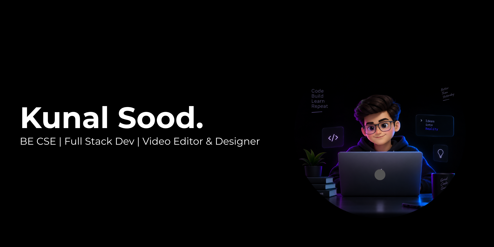

<!--
  Setup: repo must be named "KunalSood-19" (public) with this file at the root as README.md.
  Upload banner.png to the repo root.
-->

<div align="center">
  

  <a href="https://github.com/KunalSood-19">
    
  </a>

  <br/>

  <a href="https://www.linkedin.com/in/kunalsood19"></a>
  <a href="https://kunalsoodin.vercel.app/"></a>
  <a href="mailto:kunaalsood15@gmail.com"></a>
 
  
</div>

<br/>

## 👨‍💻 About

I'm a third-year B.Tech CSE student at Chitkara University who builds end-to-end web and mobile products, from database design and APIs to the interface, with AI features where they add real value. I also bring hands-on experience in graphic design and video editing, which helps me ship products that are both well-engineered and visually polished. My focus is on applications for the Indian market.

```java
public class KunalSood {
    String education = "B.E. CSE (3rd Year) @ Chitkara University";
    String focus     = "Full-Stack Development";
    String interests = "Video Editing & Graphic Design";
    String goal      = "Ship real products, not just tutorials.";
}
```

---

## 🛠️ Tech Stack

<table>
  <tr>
    <td width="150"><b>Languages</b></td>
    <td></td>
  </tr>
  <tr>
    <td><b>Frontend</b></td>
    <td></td>
  </tr>
  <tr>
    <td><b>Backend &amp; Data</b></td>
    <td></td>
  </tr>
  <tr>
    <td><b>Tools</b></td>
    <td></td>
  </tr>
  <tr>
    <td><b>AI / ML</b></td>
    <td>Gemini API &nbsp;·&nbsp; Groq API &nbsp;·&nbsp; Scikit-learn &nbsp;·&nbsp; Regression, SVM, KNN, Decision Trees</td>
  </tr>
  <tr>
    <td><b>Design &amp; Media</b></td>
    <td>Graphic Design &nbsp;·&nbsp; Video Editing &nbsp;·&nbsp; UI/UX with Figma</td>
  </tr>
  <tr>
    <td><b>Foundations</b></td>
    <td>Data Structures &amp; Algorithms (Java) &nbsp;·&nbsp; Discrete Structures &nbsp;·&nbsp; Computer Networking</td>
  </tr>
</table>

---

## 🚀 Projects

<br/>

| Project | Description | Stack | Status | Links |
|---|---|---|:-:|---|
| **Vertex** | AI-powered career and recruitment platform with resume building, ATS analysis, AI interview preparation, job recommendations, and recruiter candidate screening. | `React` `TypeScript` `Supabase` `Prisma` `Tailwind v4` |  | [](https://job-connect-ai-jobconnect-ai-omega.vercel.app/) [](https://github.com/KunalSood-19/Job-Connect-AI) |
| **Optix** | Intelligent document scanner and Google Lens alternative featuring Circle-to-Search, OCR, AI summaries, math solving, object detection, and a secure PDF vault. | `React Native` `Expo` `Supabase` `Groq AI` |  | [](https://github.com/KunalSood-19/Optix_AI) |
| **InsightCart** | Interactive e-commerce analytics dashboard providing sales, revenue, order, product, and customer insights through data-driven visualizations. | `HTML` `CSS` `JavaScript` `Chart.js` `Node.js` `Express.js` `MySQL` |  | [](https://github.com/KunalSood-19/InsightCart) |
| **MeetHub+** | WebRTC video calling platform with AI meeting summaries, shared whiteboard, and collaborative notepad. | `Node.js` `Express` `Socket.io` `WebRTC` |  | [](https://github.com/KunalSood-19/MeetHub-) |
| **UrbanHub** | Movie ticket booking platform combined with convenient home service booking. | `React` `MongoDB` `Firebase` |  | [](https://github.com/KunalSood-19/UrbanHub) |
| **Portfolio Site** | Dark code-editor style personal portfolio with animated backgrounds and interactive sections. | `Next.js` `Tailwind` `Framer Motion` |  | [](https://kunalsoodin.vercel.app/) [](https://github.com/KunalSood-19/portfolio) |
## 📊 GitHub Stats

<div align="center">
  
  
  <br/>
  
</div>
<br/>

<div align="center">
  <sub>Open to internships and collaborations · Let's build something together</sub>
  <br/>
  
</div>
